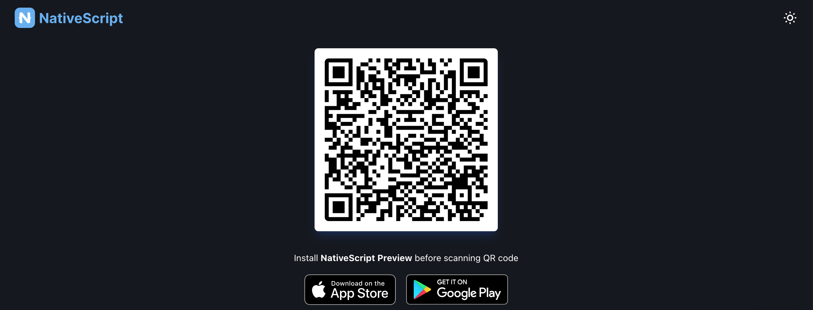

# NativeScript Speedometer

A minimalistic offline speedometer app built with NativeScript that provides real-time speed measurements using your device's GPS. The app features a clean, easy-to-read interface with dark mode support and unit conversion.

# How to use in your phone
- In your iphone download the "**NativeScript** App form the App store or Playstore.
- 
- Scan the QR code


- After scanning the QR Code, it redirects to the NativeScript app, builds the app, and launches it once the process is complete.


## Features

- Real-time speed monitoring using device GPS
- Toggle between MPH and KM/H units
- Dark mode optimized display
- Large, clear speed readings
- Completely offline functionality
- Automatic GPS status monitoring
- Battery-efficient location tracking

## Prerequisites

- Node.js 14 or later
- NativeScript CLI
- Android SDK (for Android development)
- Xcode (for iOS development)

## Installation

1. Clone the repository
2. Install dependencies:
```bash
npm install
```

## Development

To start the development server:
```bash
ns preview
```

For platform-specific development:
```bash
ns run android  # For Android
ns run ios      # For iOS
```

## Project Structure

```
app/
├── components/           # UI components
│   ├── speed-display.ts    # Speed display logic
│   └── speed-display.xml   # Speed display UI
├── utils/               # Utility functions
│   └── speed.ts           # Speed conversion utilities
├── app.css             # Global styles
├── app.ts              # Application entry point
└── app-root.xml        # Root component
```

## Permissions

### Android
The app requires the following permissions:
- ACCESS_FINE_LOCATION
- ACCESS_COARSE_LOCATION

### iOS
Required permissions:
- NSLocationWhenInUseUsageDescription
- NSLocationAlwaysUsageDescription
- NSLocationAlwaysAndWhenInUseUsageDescription

## Technical Details

- Built with NativeScript 8.8.0
- Uses @nativescript/geolocation for GPS functionality
- Implements Tailwind CSS for styling
- TypeScript for type-safe development
- Reactive UI updates using NativeScript Observable patterns

## Performance Considerations

- GPS updates are optimized with:
  - 100ms minimum update time
  - 1-meter minimum distance change
  - High accuracy mode for precise readings
- Automatic cleanup of location watchers
- Proper handling of app suspension and resume

## Contributing

1. Fork the repository
2. Create your feature branch (`git checkout -b feature/AmazingFeature`)
3. Commit your changes (`git commit -m 'Add some AmazingFeature'`)
4. Push to the branch (`git push origin feature/AmazingFeature`)
5. Open a Pull Request

## License

This project is licensed under the MIT License - see the LICENSE file for details.

## Acknowledgments

- NativeScript team for the excellent mobile development framework
- Contributors to @nativescript/geolocation
